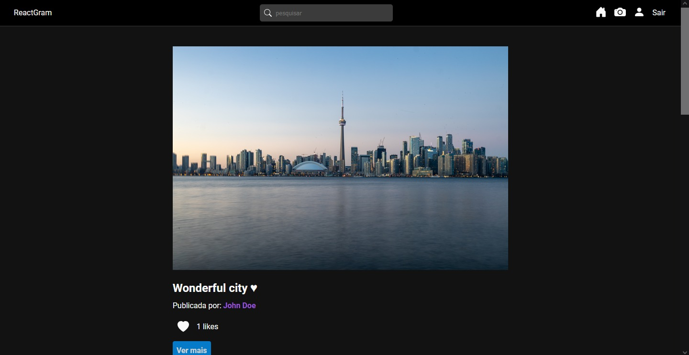

# ReactGram

## Sobre o projeto

Projeto Full-Stack que simula uma aplicação de fotos semelhante ao instagram, onde o usuário deve criar uma conta pra poder ter acesso ao sistema.

O Back-end foi criado utilizando o Node e o Front-end com React.

## Principais conceitos e aprendizados no Back-End

- Models
- Controllers
- Banco de dados (mongoDB)
- Middlewares

## Principais conceitos e aprendizados no Front-end

- Reutilização de componentes
- Redux
- Como usar Tokens
- Uso correto de Services e Slice
- Custom hooks e React hooks
